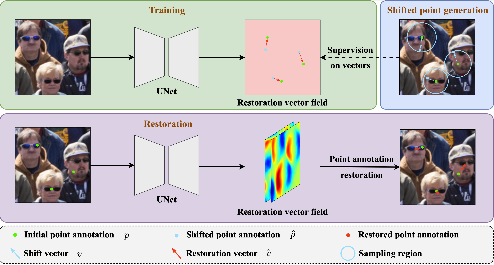

# Shifted Autoencoders for Point Annotation Restoration in Object Counting (ECCV 2024)

This repository includes the official implementation of the paper: 

[**Shifted Autoencoders for Point Annotation Restoration in Object Counting**]

European Conference on Computer Vision (ECCV), 2024
<sup>1</sup>Wuhan University, China  

[[Paper]](https://www.ecva.net/papers/eccv_2024/papers_ECCV/papers/03594.pdf) | [[Supplementary]](https://www.ecva.net/papers/eccv_2024/papers_ECCV/papers/03594-supp.pdf)




## Installation

- Install packages:

```
pip install -r requirements.txt
```


## Data Preparation


## Training

- Download ImageNet pretrained [vgg16_bn](https://download.pytorch.org/models/vgg16_bn-6c64b313.pth). Or you can define your pre-trained model path in [models/vgg.py](models/vgg.py)
  

- To train SAE on UCF_QNRF dataset, run
  
  ```
  train_Point_Shift_all_UCF_QNRF.py
  ```
  
## Citation

If you find this work helpful for your research, please consider citing:

```
@inproceedings{zou2024shifted,
  title={Shifted Autoencoders for Point Annotation Restoration in Object Counting},
  author={Zou, Yuda and Xiao, Xin and Zhou, Peilin and Sun, Zhichao and Du, Bo and Xu, Yongchao},
  booktitle={European Conference on Computer Vision},
  pages={113--130},
  year={2024},
  organization={Springer}
}
```


## Permission

This code is for academic purposes only.


